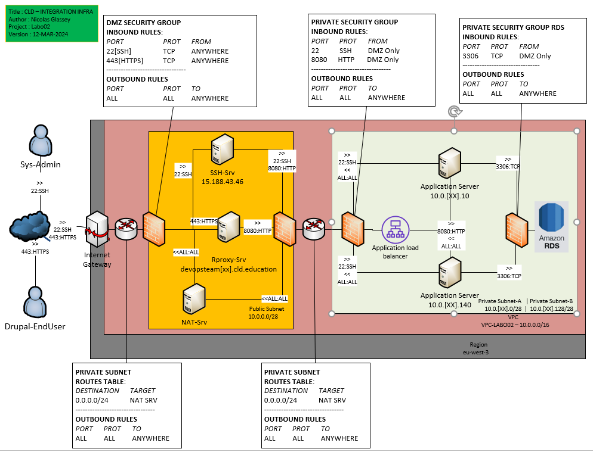

### Deploy the elastic load balancer

In this task you will create a load balancer in AWS that will receive
the HTTP requests from clients and forward them to the Drupal
instances.



## Task 01 Prerequisites for the ELB

* Create a dedicated security group

|Key|Value|
|:--|:--|
|Name|SG-DEVOPSTEAM[XX]-LB|
|Inbound Rules|Application Load Balancer|
|Outbound Rules|Refer to the infra schema|

```bash
[INPUT]
aws ec2 create-security-group \
--group-name SG-DEVOPSTEAM17-LB \
--description "Security group for LB of the DEVOPSTEAM17" \
--vpc-id $(aws ec2 describe-vpcs | jq -r ".Vpcs[0].VpcId")

aws ec2 authorize-security-group-ingress \
--protocol tcp \
--port 8080 \
--cidr 10.0.0.0/28 \
--tag-specifications 'ResourceType=security-group-rule,Tags=[{Key=Description,Value="ALL HTTP TRAFFIC FROM DMZ"}]' \
--group-id $(aws ec2 describe-security-groups --filters "Name=group-name, Values=SG-DEVOPSTEAM17-LB" | jq -r '.SecurityGroups[0].GroupId')

[OUTPUT]

{
    "GroupId": "sg-0ea9660af951df7e5"
}
---
{
    "Return": true,
    "SecurityGroupRules": [
        {
            "SecurityGroupRuleId": "sgr-070c1a3a46efc2939",
            "GroupId": "sg-0ea9660af951df7e5",
            "GroupOwnerId": "709024702237",
            "IsEgress": false,
            "IpProtocol": "tcp",
            "FromPort": 8080,
            "ToPort": 8080,
            "CidrIpv4": "0.0.0.0/0",
            "Tags": [
                {
                    "Key": "Description",
                    "Value": "ALL HTTP TRAFFIC FROM DMZ"
                }
            ]
        }
    ]
}
```

* Create the Target Group

|Key|Value|
|:--|:--|
|Target type|Instances|
|Name|TG-DEVOPSTEAM[XX]|
|Protocol and port|Refer to the infra schema|
|Ip Address type|IPv4|
|VPC|Refer to the infra schema|
|Protocol version|HTTP1|
|Health check protocol|HTTP|
|Health check path|/|
|Port|Traffic port|
|Healthy threshold|2 consecutive health check successes|
|Unhealthy threshold|2 consecutive health check failures|
|Timeout|5 seconds|
|Interval|10 seconds|
|Success codes|200|

```bash
[INPUT]

aws elbv2 create-target-group --name TG-DEVOPSTEAM17 \
--protocol HTTP --port 80 --vpc-id $(aws ec2 describe-vpcs | jq -r ".Vpcs[0].VpcId") \
--health-check-path / --health-check-interval-seconds 10 --health-check-timeout-seconds 5 --healthy-threshold-count 2 --unhealthy-threshold-count 2


aws elbv2 create-listener \
--load-balancer-arn $(aws elbv2 describe-load-balancers --names ELB-DEVOPSTEAM17 | jq -r '.LoadBalancers[0].LoadBalancerArn') \
--protocol HTTP \
--port 8080 \
--default-actions Type=forward,TargetGroupArn=$(aws elbv2 describe-target-groups --names TG-DEVOPSTEAM17 | jq -r '.TargetGroups[0].TargetGroupArn')

 aws elbv2 register-targets --target-group-arn $(aws elbv2 describe-target-groups --names TG-DEVOPSTEAM17 | jq -r '.TargetGroups[0].TargetGroupArn') \ 
--targets $(aws ec2 describe-instances --filters "Name=tag:Name, Values=EC2_PRIVATE_DRUPAL_DEVOPSTEAM17_*" | jq -r '[.Reservations[].Instances[] | "Id=" + .InstanceId + ",Port=8080"] | join(" ")')


[OUTPUT]
{
    "TargetGroups": [
        {
            "TargetGroupArn": "arn:aws:elasticloadbalancing:eu-west-3:709024702237:targetgroup/TG-DEVOPSTEAM17/633640a1c9e6f20d",
            "TargetGroupName": "TG-DEVOPSTEAM17",
            "Protocol": "HTTP",
            "Port": 80,
            "VpcId": "vpc-03d46c285a2af77ba",
            "HealthCheckProtocol": "HTTP",
            "HealthCheckPort": "traffic-port",
            "HealthCheckEnabled": true,
            "HealthCheckIntervalSeconds": 10,
            "HealthCheckTimeoutSeconds": 5,
            "HealthyThresholdCount": 2,
            "UnhealthyThresholdCount": 2,
            "HealthCheckPath": "/",
            "Matcher": {
                "HttpCode": "200"
            },
            "TargetType": "instance",
            "ProtocolVersion": "HTTP1",
            "IpAddressType": "ipv4"
        }
    ]
}
---
{
    "Listeners": [
        {
            "ListenerArn": "arn:aws:elasticloadbalancing:eu-west-3:709024702237:listener/app/ELB-DEVOPSTEAM17/383a79078685a67a/f98a5e2485814cd9",
            "LoadBalancerArn": "arn:aws:elasticloadbalancing:eu-west-3:709024702237:loadbalancer/app/ELB-DEVOPSTEAM17/383a79078685a67a",
            "Port": 8080,
            "Protocol": "HTTP",
            "DefaultActions": [
                {
                    "Type": "forward",
                    "TargetGroupArn": "arn:aws:elasticloadbalancing:eu-west-3:709024702237:targetgroup/TG-DEVOPSTEAM17/633640a1c9e6f20d",
                    "ForwardConfig": {
                        "TargetGroups": [
                            {
                                "TargetGroupArn": "arn:aws:elasticloadbalancing:eu-west-3:709024702237:targetgroup/TG-DEVOPSTEAM17/633640a1c9e6f20d",
                                "Weight": 1
                            }
                        ],
                        "TargetGroupStickinessConfig": {
                            "Enabled": false
                        }
                    }
                }
            ]
        }
    ]
}
```


## Task 02 Deploy the Load Balancer

[Source](https://aws.amazon.com/elasticloadbalancing/)

* Create the Load Balancer

|Key|Value|
|:--|:--|
|Type|Application Load Balancer|
|Name|ELB-DEVOPSTEAM99|
|Scheme|Internal|
|Ip Address type|IPv4|
|VPC|Refer to the infra schema|
|Security group|Refer to the infra schema|
|Listeners Protocol and port|Refer to the infra schema|
|Target group|Your own target group created in task 01|

Provide the following answers (leave any
field not mentioned at its default value):

```bash
[INPUT]

aws elbv2 create-load-balancer \
--name ELB-DEVOPSTEAM17 \
--subnets $(aws ec2 describe-subnets --filters "Name=tag:Name, Values=SUB-PRIVATE-DEVOPSTEAM17a" | jq -r ".Subnets[].SubnetId") $(aws ec2 describe-subnets --filters "Name=tag:Name, Values=SUB-PRIVATE-DEVOPSTEAM17b" | jq -r ".Subnets[].SubnetId") \
--security-groups $(aws ec2 describe-security-groups --filters "Name=group-name, Values=SG-DEVOPSTEAM17-LB" | jq -r '.SecurityGroups[0].GroupId') \
--scheme internal \
--ip-address-type ipv4 \
--type application

[OUTPUT]

{
    "LoadBalancers": [
        {
            "LoadBalancerArn": "arn:aws:elasticloadbalancing:eu-west-3:709024702237:loadbalancer/app/ELB-DEVOPSTEAM17/383a79078685a67a",
            "DNSName": "internal-ELB-DEVOPSTEAM17-2061856987.eu-west-3.elb.amazonaws.com",
            "CanonicalHostedZoneId": "Z3Q77PNBQS71R4",
            "CreatedTime": "2024-03-21T14:14:01.370000+00:00",
            "LoadBalancerName": "ELB-DEVOPSTEAM17",
            "Scheme": "internal",
            "VpcId": "vpc-03d46c285a2af77ba",
            "State": {
                "Code": "provisioning"
            },
            "Type": "application",
            "AvailabilityZones": [
                {
                    "ZoneName": "eu-west-3b",
                    "SubnetId": "subnet-04498bd788c84b3b8",
                    "LoadBalancerAddresses": []
                },
                {
                    "ZoneName": "eu-west-3a",
                    "SubnetId": "subnet-05d1358ba969d29fd",
                    "LoadBalancerAddresses": []
                }
            ],
            "SecurityGroups": [
                "sg-0ea9660af951df7e5"
            ],
            "IpAddressType": "ipv4"
        }
    ]
}

```

* Get the ELB FQDN (DNS NAME - A Record)

```bash
[INPUT]
aws elbv2 describe-load-balancers --names ELB-DEVOPSTEAM17 | jq '.LoadBalancers[].DNSName'

[OUTPUT]
"internal-ELB-DEVOPSTEAM17-2061856987.eu-west-3.elb.amazonaws.com"
```

* Get the ELB deployment status

Note : In the EC2 console select the Target Group. In the
       lower half of the panel, click on the **Targets** tab. Watch the
       status of the instance go from **unused** to **initial**.

* Ask the DMZ administrator to register your ELB with the reverse proxy via the private teams channel

* Update your string connection to test your ELB and test it

```bash
ssh devopsteam17@15.188.43.46 -i ../secrets/CLD_KEY_DMZ_DEVOPSTEAM17.pem -L 1780:internal-ELB-DEVOPSTEAM17-2061856987.eu-west-3.elb.amazonaws.com:8080
```

* Test your application through your ssh tunneling

```bash
[INPUT]
curl -svo /dev/null localhost:1780

[OUTPUT]

* Host localhost:1780 was resolved.
* IPv6: ::1
* IPv4: 127.0.0.1
*   Trying [::1]:1780...
* Connected to localhost (::1) port 1780
> GET / HTTP/1.1
> Host: localhost:1780
> User-Agent: curl/8.6.0
> Accept: */*
>
< HTTP/1.1 200 OK
< Date: Thu, 21 Mar 2024 15:55:30 GMT
< Content-Type: text/html; charset=UTF-8
< Content-Length: 16554
< Connection: keep-alive
< Server: Apache
< Cache-Control: must-revalidate, no-cache, private
< X-Drupal-Dynamic-Cache: MISS
< Content-language: en
< X-Content-Type-Options: nosniff
< X-Frame-Options: SAMEORIGIN
< Expires: Sun, 19 Nov 1978 05:00:00 GMT
< X-Generator: Drupal 10 (https://www.drupal.org)
< X-Drupal-Cache: HIT
< Vary: Accept-Encoding
<
{ [16554 bytes data]
* Connection #0 to host localhost left intact
```

#### Questions - Analysis

* On your local machine resolve the DNS name of the load balancer into
  an IP address using the `nslookup` command (works on Linux, macOS and Windows). Write
  the DNS name and the resolved IP Address(es) into the report.

```
❯ nslookup internal-ELB-DEVOPSTEAM17-2061856987.eu-west-3.elb.amazonaws.com

Name:   internal-ELB-DEVOPSTEAM17-2061856987.eu-west-3.elb.amazonaws.com
Address: 10.0.17.139
Name:   internal-ELB-DEVOPSTEAM17-2061856987.eu-west-3.elb.amazonaws.com
Address: 10.0.17.7
```

* From your Drupal instance, identify the ip from which requests are sent by the Load Balancer.

Help : execute `tcpdump port 8080`

```
16:07:47.526350 IP 10.0.17.7.38538 > provisioner-local.http-alt: Flags [P.], seq 1:131, ack 1, win 106, options [nop,nop,TS val 2902575067 ecr 666852689], length 130: HTTP: GET / HTTP/1.1
```

* In the Apache access log identify the health check accesses from the
  load balancer and copy some samples into the report.

```
10.0.17.139 - - [21/Mar/2024:15:59:27 +0000] "GET / HTTP/1.1" 200 5147
10.0.17.7 - - [21/Mar/2024:15:59:27 +0000] "GET / HTTP/1.1" 200 5147
10.0.17.139 - - [21/Mar/2024:15:59:37 +0000] "GET / HTTP/1.1" 200 5147
10.0.17.7 - - [21/Mar/2024:15:59:37 +0000] "GET / HTTP/1.1" 200 5147
10.0.17.139 - - [21/Mar/2024:15:59:47 +0000] "GET / HTTP/1.1" 200 5147
10.0.17.7 - - [21/Mar/2024:15:59:47 +0000] "GET / HTTP/1.1" 200 5147
```
