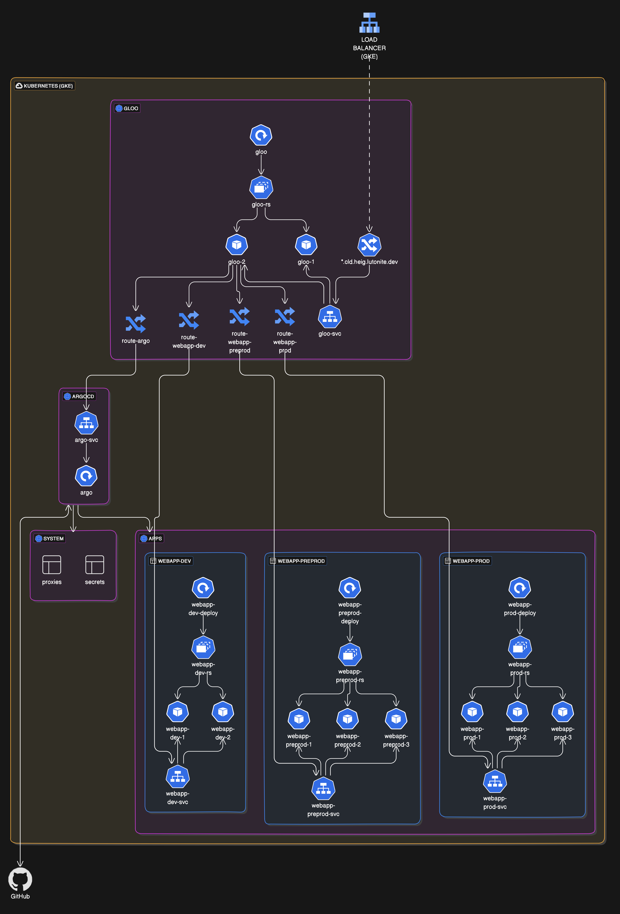

# Deploying ArgoCD on GKE to deploy scalable applications

## POC objectives

Validate the possible use of ArgoCD in a Kubernetes environment to manage scalable applications reliably using GitOps principles in the context of a scalable, automated, and consistent deployment pipeline.

## Infra architecture

The infrastructure consists of the following logical components:

- **Kubernetes Cluster**: A managed GKE (Google Kubernetes Engine) cluster.
- **ArgoCD**: A continuous delivery tool for Kubernetes, deployed within the GKE cluster.
- **Git Repository**: A Git repository hosted on GitHub, containing application manifests and configurations.
- **Networking**: The ArgoCD application should be accessed using a standard HTTPS connection on a load balancer to the cluster.
- **Cloud Type**: Public cloud infrastructure on Google Cloud Platform (GCP), a platform-as-a-service.

### Simplified diagram



## Scenario

Describe step-by-step the scenario. Write it using this format (BDD style).

### STEP 01

```
//given -> A GitHub repository containing the Kubernetes manifests and application configurations.
//when -> A change (e.g., a new commit) is pushed to the repository.
//then -> ArgoCD detects the change, syncs the new configuration, and deploys the updated application to the Kubernetes cluster.
```

### STEP 02

```
//given -> ArgoCD is deployed and configured within the GKE cluster, with access to the GitHub repository.
//when -> The application state in the GitHub repository is updated (e.g., a new version of the application is committed).
//then -> ArgoCD pulls the latest changes, applies them to the Kubernetes cluster, and updates the application to the new version.
```

### STEP 03

```
//given -> The application is successfully deployed and running in the Kubernetes cluster.
//when -> An issue is detected in the deployed application (e.g., a failing health check).
//then -> ArgoCD reverts to the previous stable state from the GitHub repository, restoring the application's functionality.
```

### STEP 04

```
//given -> The application is updated on the git repository 
//when -> The application is scheduled to be updated outside of business hours
//then -> ArgoCD will refuse the change to be applied before the next working day
```

### STEP 05

```
//given -> A new commit is pushed on the git repository
//when -> The commit is not signed by a Ops GPG key
//then -> ArgoCD will refuse the sync of the application
```

## Cost

ArgoCD is free and open-source software backed by the cloud-native foundation, as such it does not cost anything to use it in any cluster.

The main source of cost is the Kubernetes cluster, handled by the Google Kubernetes Engine, though we did apply some strategies to reduce the cost for the purposes of this demonstration.
But it is to be made clear that some of the techniques used to minimize cost would not be advisable for a production deployment.

Our running cost per day is $2.96 on the Kubernetes Engine (a cluster with 3 e2-small nodes with the minimum settings, in spot instance configuration).
Most of the price is for the control plane, which Google charges a lot of money for.
Added on is the price of the single external load balancer which is a flat rate of $1.00 per day with additional costs depending on usage.

As such, the techniques we used to minimize the costs are as follows:

- The cluster is deployed in Europe's cheapest region (Belgium) in a regional configuration with 3 spot instances.
- A single external load balancer is setup for the cluster, in which we internally use Gloo Edge -- an envoy-based reverse proxy that is very configurable and allows settings such as request retries (useful in case one of the spot instances gets destroyed).

As such, for the period in which we setup and tested our usecases the price was only ~$4.00 per day.

## Return of experience

The POC demonstrated that ArgoCD is a highly effective tool for managing Kubernetes deployments using GitOps principles. The deployment process was smooth, and the integration with GKE and GitHub proved to be seamless. ArgoCD's ability to automatically sync and deploy changes from the Git repository to the Kubernetes cluster ensured a consistent and reliable deployment pipeline.

The objectives of the POC were validated as follows:
- **Scalability:** ArgoCD effectively managed scalable applications in the Kubernetes environment, handling updates and rollbacks efficiently.
- **Reliability:** The system reliably detected changes in the GitHub repository and deployed them to the cluster, ensuring that the application was always up-to-date.
- **Automation:** The deployment pipeline was highly automated, reducing the need for manual intervention and minimizing human errors.
- **Cost-effectiveness:** The cost optimization strategies employed demonstrated that it is possible to run ArgoCD on GKE in a cost-effective manner, though some of these strategies may need to be adjusted for production environments.

One significant advantage of using ArgoCD paired with Kubernetes is the reduction of vendor lock-in. Since Kubernetes is supported by all major cloud providers and ArgoCD operates purely within the Kubernetes ecosystem, this setup is almost cloud agnostic. This flexibility allows for easier migration between different cloud providers or even a hybrid/multi-cloud strategy without significant changes to the deployment pipeline.

Overall, the POC confirmed that ArgoCD is a robust solution for managing Kubernetes deployments in a scalable, automated, and consistent manner.
